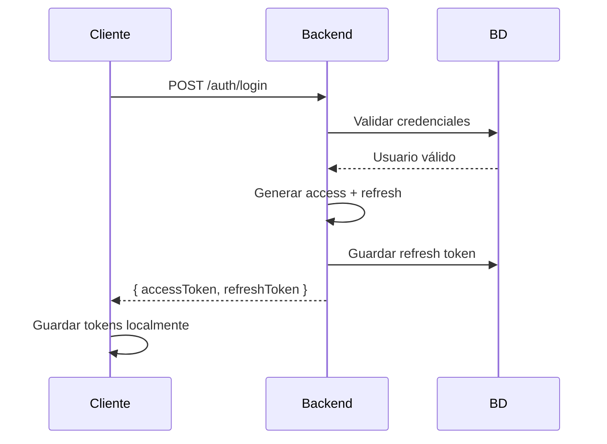
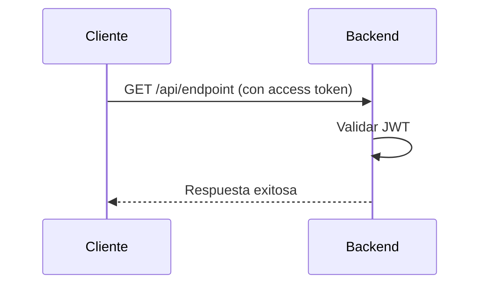
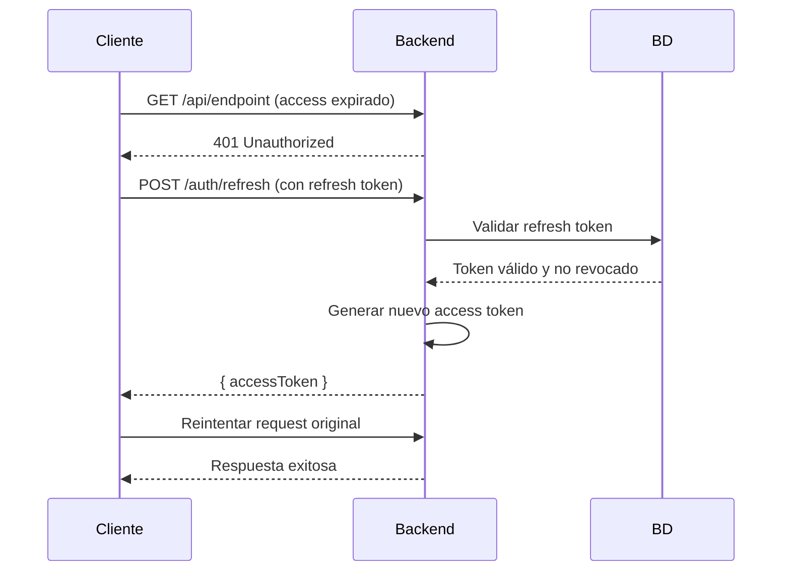
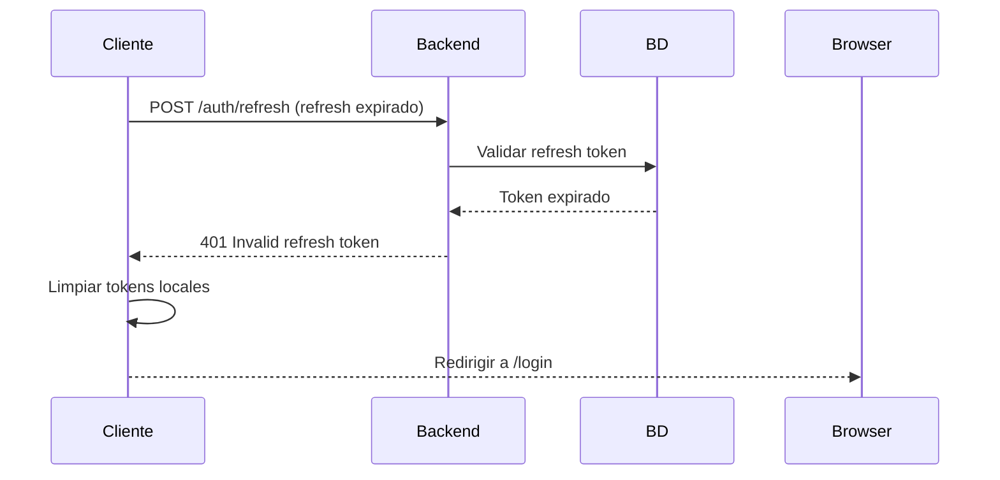

# Estrategia de Refresh Token - Sistema de Autenticación

## 📋 Resumen Ejecutivo

Este documento explica la implementación del sistema de **Access Token + Refresh Token** en el ecommerce, sus beneficios de seguridad, y cómo funciona en la práctica para mantener a los usuarios autenticados de forma segura y fluida.

## 🧩 Conceptos Fundamentales

### ¿Qué son los tokens?

| Token Type | Duración | Formato | Almacenamiento | Propósito |
|------------|----------|---------|----------------|-----------|
| **Access Token** | 30 minutos | JWT firmado | Memoria/LocalStorage | Autenticar cada request |
| **Refresh Token** | 7 días | String aleatorio | Base de datos | Renovar access tokens |

### Access Token (JWT)
```typescript
// Ejemplo de payload
{
  sub: "user_id_12345",
  email: "cliente@marca.com",
  role: "user",
  permissions: ["profile:read", "profile:write"],
  iat: 1728262520, // Emitido
  exp: 1728264320  // Expira en 30 min
}
```

### Refresh Token (String aleatorio)
```typescript
// Generación
const refreshToken = crypto.randomBytes(32).toString('hex');
// Ejemplo: "a1b2c3d4e5f6789012345678901234567890abcdef"

// Almacenado en BD con metadata
{
  token: "a1b2c3d4e5f6...",
  userId: ObjectId("665f1ea0ab12cd3456789012"),
  expiresAt: new Date("2025-10-14T00:00:00.000Z"),
  isRevoked: false,
  userAgent: "Chrome 118.0 on MacOS",
  ipAddress: "192.168.1.100",
  createdAt: new Date("2025-10-07T00:00:00.000Z")
}
```

## 🔐 Problema que Resuelve

### ❌ Sin Refresh Token (Problemático)

**Opción A: Access Token Largo (24 horas)**
```typescript
const accessToken = jwt.sign(payload, secret, { expiresIn: '24h' });
```

**Problemas:**
- Token robado → 24 horas de acceso no revocable
- Imposible deslogear usuarios comprometidos
- Cambio de password no invalida tokens existentes
- Sin audit trail de accesos

**Opción B: Access Token Corto sin Refresh**
```typescript
const accessToken = jwt.sign(payload, secret, { expiresIn: '30m' });
```

**Problemas:**
- Usuario se desloguea cada 30 minutos
- Experiencia frustrante (abandono de compras)
- Re-login constante = menos conversiones

### ✅ Con Refresh Token (Solución Óptima)

```typescript
// Access token corto para seguridad
const accessToken = jwt.sign(payload, secret, { expiresIn: '30m' });

// Refresh token largo pero revocable
const refreshToken = crypto.randomBytes(32).toString('hex');
await this.refreshTokenModel.create({
  token: refreshToken,
  userId: user._id,
  expiresAt: new Date(Date.now() + 7 * 24 * 60 * 60 * 1000), // 7 días
  isRevoked: false
});
```

## 🎯 Beneficios del Sistema Actual

### 1. **Seguridad Mejorada**
- **Access token robado:** Solo útil por 30 minutos máximo
- **Refresh token robado:** Se revoca en BD inmediatamente
- **Breach de servidor:** Solo acceso a tokens temporales

### 2. **Control Granular**
```typescript
// Deslogear usuario específico
await this.authService.logout(refreshToken);

// Deslogear todos los dispositivos del usuario
await this.authService.logoutAll(userId);

// Audit trail completo
const userSessions = await this.refreshTokenModel.find({ 
  userId, 
  isRevoked: false 
}).select('userAgent ipAddress createdAt');
```

### 3. **Experiencia de Usuario Fluida**
- Navegación continua sin interrupciones
- Renovación automática transparente
- Re-autenticación solo cada 7 días

### 4. **Casos de Uso Empresariales**

#### Empleado Despedido
```typescript
// RR.HH. desactiva cuenta
await userService.update(empleadoId, { status: 'inactive' });

// En próximo refresh → falla por user.status !== 'active'
// Empleado pierde acceso inmediatamente sin cambiar tokens
```

#### Dispositivo Perdido
```typescript
// Cliente: "Perdí mi celular"
const sessions = await refreshTokenModel.find({ userId })
  .select('userAgent ipAddress createdAt');

// Admin identifica el dispositivo y revoca solo ese token
await authService.logout(tokenDelCelularPerdido);
```

#### Actividad Sospechosa
```typescript
// Admin detecta login desde país inusual
const suspiciousTokens = await refreshTokenModel.find({
  userId,
  ipAddress: { $regex: /^suspicious-ip-pattern/ }
});

await Promise.all(
  suspiciousTokens.map(token => authService.logout(token.token))
);
```

## 🔄 Flujo Completo de Autenticación

### 1. **Login Inicial**


### 2. **Navegación Normal (0-30 min)**


### 3. **Renovación Automática (30+ min)**


### 4. **Re-autenticación (7+ días)**


## 💻 Implementación en Frontend

### Interceptor Automático (Recomendado)
```javascript
// axios interceptor para manejo automático
import axios from 'axios';

axios.interceptors.response.use(
  response => response,
  async error => {
    const originalRequest = error.config;
    
    if (error.response?.status === 401 && !originalRequest._retry) {
      originalRequest._retry = true;
      
      try {
        const refreshToken = localStorage.getItem('refreshToken');
        const { data } = await axios.post('/auth/refresh', { refreshToken });
        
        localStorage.setItem('accessToken', data.accessToken);
        axios.defaults.headers.common['Authorization'] = `Bearer ${data.accessToken}`;
        
        return axios(originalRequest);
      } catch (refreshError) {
        // Refresh falló → logout
        localStorage.clear();
        window.location.href = '/login';
        return Promise.reject(refreshError);
      }
    }
    
    return Promise.reject(error);
  }
);
```

### Renovación Proactiva (Opcional)
```javascript
// Renovar antes de que expire
function startTokenRefreshInterval() {
  setInterval(async () => {
    const token = localStorage.getItem('accessToken');
    if (token && isTokenExpiringSoon(token)) {
      await refreshAccessToken();
    }
  }, 5 * 60 * 1000); // Chequear cada 5 minutos
}

function isTokenExpiringSoon(token) {
  try {
    const payload = JSON.parse(atob(token.split('.')[1]));
    const expTime = payload.exp * 1000;
    const timeLeft = expTime - Date.now();
    return timeLeft < 10 * 60 * 1000; // Menos de 10 minutos
  } catch {
    return true; // Token inválido
  }
}

async function refreshAccessToken() {
  try {
    const refreshToken = localStorage.getItem('refreshToken');
    const response = await fetch('/auth/refresh', {
      method: 'POST',
      headers: { 'Content-Type': 'application/json' },
      body: JSON.stringify({ refreshToken })
    });
    
    if (response.ok) {
      const { accessToken } = await response.json();
      localStorage.setItem('accessToken', accessToken);
      return accessToken;
    } else {
      throw new Error('Refresh failed');
    }
  } catch (error) {
    // Logout y redirigir
    localStorage.clear();
    window.location.href = '/login';
  }
}
```

## 🚨 Casos de Seguridad

### Scenario 1: Breach de Base de Datos
```
Atacante obtiene → Refresh tokens (strings aleatorios)
Atacante NO obtiene → Passwords (hasheados) ni JWT secrets
Mitigación → Revocar todos los refresh tokens
```

### Scenario 2: Token Interceptado (Man in the Middle)
```
Access token interceptado → Solo útil por 30 minutos
Refresh token interceptado → Se revoca en BD inmediatamente
Detección → Logs de IPs inusuales en refresh tokens
```

### Scenario 3: XSS Attack
```
Script malicioso roba tokens → Solo access token (30 min)
httpOnly cookies → Refresh token protegido de XSS
Mitigación adicional → SameSite cookies, CSP headers
```

## 📊 Comparación de Estrategias

| Estrategia | Seguridad | UX | Complejidad | Escalabilidad |
|------------|-----------|-------|-------------|---------------|
| **Session Cookies** | ⭐⭐⭐ | ⭐⭐⭐⭐⭐ | ⭐⭐ | ⭐⭐ |
| **JWT Largo (24h)** | ⭐⭐ | ⭐⭐⭐⭐ | ⭐⭐⭐⭐⭐ | ⭐⭐⭐⭐⭐ |
| **JWT + Refresh** | ⭐⭐⭐⭐⭐ | ⭐⭐⭐⭐ | ⭐⭐⭐ | ⭐⭐⭐⭐⭐ |

## 🛠️ Configuración en el Proyecto

### Variables de Entorno
```env
JWT_SECRET=tu_super_secreto_muy_largo
JWT_EXPIRATION=30m
REFRESH_TOKEN_EXPIRATION_DAYS=7
```

### Configuración de Módulos
```typescript
// auth.module.ts
JwtModule.registerAsync({
  imports: [ConfigModule],
  useFactory: (config: ConfigService) => ({
    secret: config.get('JWT_SECRET'),
    signOptions: { 
      expiresIn: config.get('JWT_EXPIRATION', '30m') 
    },
  }),
  inject: [ConfigService],
})
```

### Schema de Refresh Token
```typescript
@Schema({ timestamps: true })
export class RefreshToken {
  @Prop({ required: true, unique: true })
  token: string;

  @Prop({ type: SchemaTypes.ObjectId, ref: 'User', required: true })
  userId: Types.ObjectId;

  @Prop({ required: true })
  expiresAt: Date;

  @Prop({ default: false })
  isRevoked: boolean;

  @Prop()
  userAgent?: string;

  @Prop()
  ipAddress?: string;
}
```

## 🎯 Casos de Uso Específicos - Ecommerce de Remeras

### Cliente Navegando
```
1. Login desde móvil → Access (30min) + Refresh (7 días)
2. Ve catálogo por 2 horas → 4 renovaciones automáticas
3. Agrega productos al carrito → Sin interrupciones
4. Procesa pago → Mantiene sesión durante checkout
5. Vuelve al día siguiente → Sigue logueado
6. Después de una semana → Debe re-loguearse
```

### Administrador del Negocio
```
1. Login desde laptop → Gestiona productos por horas
2. Cambio de precios masivo → Sin deslogueos
3. Ve analytics en tiempo real → Renovación transparente
4. Sospecha de acceso no autorizado → Revoca todos los tokens
5. Empleado temporal → Token con expiración específica
```

### Casos de Soporte
```
Cliente: "No puedo acceder desde mi celular nuevo"
→ Revisar refresh tokens por userAgent
→ Identificar dispositivos activos
→ Revocar sesiones de dispositivos viejos

Cliente: "Creo que hackearon mi cuenta"
→ Logout all + cambio de password
→ Revisar historial de IPs en refresh tokens
→ Notificar accesos sospechosos
```

## 📈 Métricas de Monitoreo

### Dashboards Recomendados
```typescript
// Métricas de refresh tokens
- Tokens activos por usuario
- Renovaciones por hora/día
- Tokens revocados (manual vs expiración)
- Distribución de user agents (dispositivos)
- Accesos por geolocalización IP

// Alertas de seguridad
- Múltiples refresh desde IPs diferentes
- Picos inusuales de renovaciones
- Intentos de refresh con tokens inválidos
```

## 🚀 Evolución Futura

### Mejoras Nivel 1 (Corto Plazo)
- Refresh token rotation (nuevo refresh en cada renovación)
- Rate limiting en endpoint /auth/refresh
- Notificaciones de nuevos dispositivos

### Mejoras Nivel 2 (Mediano Plazo)
- Fingerprinting de dispositivos
- Geolocalización y alertas
- Refresh tokens en httpOnly cookies

### Mejoras Nivel 3 (Largo Plazo)
- OAuth2 con proveedores externos
- Biometría para renovaciones sensibles
- Machine learning para detección de anomalías

## 📝 Conclusión

El sistema de **Access Token + Refresh Token** implementado proporciona:

1. **Seguridad robusta** con tokens de corta duración
2. **Experiencia fluida** sin deslogueos constantes  
3. **Control granular** para revocar accesos
4. **Audit trail completo** de sesiones activas
5. **Escalabilidad** para futuro crecimiento

Esta implementación es **industry standard** utilizada por GitHub, Google, Auth0, AWS Cognito y otras plataformas de nivel empresarial.

Para el ecommerce de remeras, garantiza que los clientes puedan navegar y comprar sin interrupciones, mientras mantienes control total sobre la seguridad y accesos al sistema.

---

**Autor:** Sistema de Autenticación - Ecommerce  
**Fecha:** Octubre 2025  
**Versión:** 1.0  
**Revisión:** Pendiente tras implementación completa